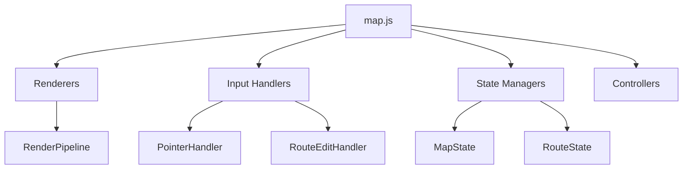

# Refactoring Wave 2 Analysis

**Generated:** January 13, 2026  
**Based on:** Current codebase state after Wave 1 refactoring

---

## Executive Summary

Wave 1 refactoring achieved **significant architectural improvements**, reducing `map.js` from 6,012 to 3,530 lines (41% reduction) and establishing a modular architecture with dedicated renderers, state managers, and input handlers. UI controllers are now partially implemented.

**Current State:** The codebase has evolved from a monolithic "god class" to a more maintainable modular structure. However, several optimization opportunities remain for performance, testability, and code quality.

### Wave 2 Objectives

| Priority | Category | Estimated Effort |
|----------|----------|------------------|
| 🔴 High | Performance Optimization | ~8-12 hours |
| 🟡 Medium | Code Quality & Patterns | ~6-8 hours |
| 🟢 Low | Testing & Documentation | ~10-15 hours |

---

## Current Codebase Metrics

### File Size Distribution (Top 15)

| File | Lines | Category | Status |
|------|-------|----------|--------|
| map.js | 3,530 | Core | 🟡 Needs further decomposition |
| PointerHandler.js | 546 | Input | ✅ Reasonably sized |
| RouteEditHandler.js | 458 | Input | ✅ Well-extracted |
| GridRenderer.js | 420 | Rendering | ✅ Good |
| SettingsController.js | 388 | Controllers | ✅ Good |
| RouteComputation.js | 370 | Data | ✅ Good |
| TileRenderer.js | 362 | Rendering | ✅ Good |
| ToolbarController.js | 355 | Controllers | ✅ Good |
| RouteRenderer.js | 325 | Rendering | ✅ Good |
| LayerState.js | 314 | State | ✅ Good |
| RenderPipeline.js | 287 | Rendering | ✅ Good |
| RouteState.js | 277 | State | ✅ Good |
| KeyboardHandler.js | 267 | Input | ✅ Good |
| SidebarController.js | 243 | Controllers | ✅ Good |
| MarkerManager.js | 240 | Data | ✅ Good |

### Architecture Summary

```
┌─────────────────────────────────────────────────────────────────┐
│                         map.js (3,530 lines)                    │
│  ┌─────────────────┐  ┌──────────────────┐  ┌────────────────┐ │
│  │ InteractiveMap  │  │ init() function  │  │ Module-level   │ │
│  │ Class (~1,900)  │  │ (~1,200 lines)   │  │ helpers (~400) │ │
│  └─────────────────┘  └──────────────────┘  └────────────────┘ │
└─────────────────────────────────────────────────────────────────┘
                              │
        ┌─────────────────────┼─────────────────────┐
        ▼                     ▼                     ▼
┌───────────────┐    ┌───────────────┐    ┌───────────────┐
│   Rendering   │    │    State      │    │    Input      │
│   (8 modules) │    │  (4 modules)  │    │  (3 modules)  │
└───────────────┘    └───────────────┘    └───────────────┘
        │                     │                     │
        ▼                     ▼                     ▼
┌───────────────┐    ┌───────────────┐    ┌───────────────┐
│  Controllers  │    │    Data       │    │    Utils      │
│  (3 modules)  │    │  (9 modules)  │    │  (4 modules)  │
└───────────────┘    └───────────────┘    └───────────────┘
```

---

## Phase 1: Performance Optimization (High Priority)

### 1.1 Extract `initializeLayerIcons()` Function (~400 lines)

**Location:** `map.js` lines 2131-2500  
**Problem:** This massive function handles layer sidebar creation, event binding, and swipe gesture detection all in one place.  
**Impact:** Difficult to maintain, test, or modify layer toggle behavior.

**Recommended Extraction:**

```javascript
// controllers/LayerListController.js
class LayerListController {
    constructor(map, config, errorHandler) {
        this.map = map;
        this.config = config;
        this.errorHandler = errorHandler;
    }
    
    init() {
        this._createLayerRows();
        this._bindLayerToggleEvents();
        this._bindSwipeGestures();
        this._bindHighlightControls();
    }
    
    _createLayerRows() { /* Build DOM from LAYERS */ }
    _bindLayerToggleEvents() { /* Checkbox/click handlers */ }
    _bindSwipeGestures() { /* Swipe-to-toggle logic */ }
    _bindHighlightControls() { /* Highlight slider/toggle */ }
}
```

**Steps:**
1. Create `controllers/LayerListController.js`
2. Extract layer row creation logic (~100 lines)
3. Extract toggle event binding (~150 lines)
4. Extract swipe gesture handling (~100 lines)
5. Extract highlight controls (~50 lines)
6. Update `init()` to use `LayerListController`

**Estimated Time:** 3-4 hours

---

### 1.2 Eliminate Remaining Empty `catch {}` Blocks

**Current Count:** ~40+ remaining empty catches in `map.js`  
**Problem:** Silent failures make debugging difficult

**Pattern to Replace:**

```javascript
// Current (problematic)
try { this.tooltip.style.borderColor = layerCol; } catch (e) {}

// Recommended (with context)
try { 
    this.tooltip.style.borderColor = layerCol; 
} catch (e) { 
    _logError(e, 'showTooltip.setBorderColor'); 
}
```

**High-Impact Locations:**
- `showTooltip()` method (lines 1640-1650) - 4 catches
- `render()` method (lines 1710-1730) - 4 catches
- `exitEditModeForLayer()` (lines 2083-2125) - 12 catches
- `initializeLayerIcons()` (lines 2131-2500) - 15+ catches

**Steps:**
1. Search for `catch (e) {}` pattern
2. Add contextual `_logError(e, 'method.operation')` calls
3. Group related operations under single try-catch where appropriate
4. Run syntax validation

**Estimated Time:** 1-2 hours

---

### 1.3 Optimize Render Loop Performance

**Location:** `InteractiveMap.render()` and `RenderPipeline.render()`  
**Problem:** Redundant canvas state saves/restores and unnecessary recalculations

**Current Issues:**
1. Multiple `ctx.save()`/`ctx.restore()` calls per render
2. Layer visibility checks repeated across renderers
3. No render batching for rapid state changes

**Recommended Optimizations:**

```javascript
// RenderPipeline.js enhancement
class RenderPipeline {
    constructor(renderers) {
        this.renderers = renderers;
        this._frameScheduled = false;
        this._dirtyFlags = new Set();
    }
    
    markDirty(rendererName) {
        this._dirtyFlags.add(rendererName);
        this._scheduleRender();
    }
    
    _scheduleRender() {
        if (this._frameScheduled) return;
        this._frameScheduled = true;
        requestAnimationFrame(() => {
            this._frameScheduled = false;
            this.render(this._dirtyFlags);
            this._dirtyFlags.clear();
        });
    }
    
    render(dirtyOnly = null) {
        const ctx = this.ctx;
        ctx.save();
        try {
            for (const renderer of this.renderers) {
                if (dirtyOnly && !dirtyOnly.has(renderer.name)) continue;
                renderer.render();
            }
        } finally {
            ctx.restore();
        }
    }
}
```

**Steps:**
1. Add dirty flag tracking to RenderPipeline
2. Implement selective re-rendering based on dirty flags
3. Batch multiple `render()` calls into single frame
4. Profile before/after to validate improvements

**Estimated Time:** 3-4 hours

---

### 1.4 Implement Object Pooling for Markers ✅ COMPLETED

**Problem:** Frequent marker object creation during route editing causes GC pressure  
**Location:** `RouteEditHandler.js`, `MarkerRenderer.js`

**Solution Implemented:**
- Created `data/ObjectPool.js` with generic ObjectPool class integrated with ErrorHandler
- Added specialized pools: `markerPool` (20 markers) and `routeSourcePool` (20 sources)
- Updated `RouteEditHandler.js` and `map.js` to use pooled objects instead of creating new ones
- Added proper cleanup in all cancellation/finalization paths
- Added debug function `checkPoolStats()` for monitoring pool usage

**Performance Impact:** Reduces GC pressure during route editing operations by reusing objects instead of creating new ones on every frame.

**Estimated Time:** 2 hours

---

## Phase 2: Code Quality & Patterns (Medium Priority)

### 2.1 Consolidate Storage Access Patterns

**Problem:** Inconsistent storage access across modules  
**Evidence:** Multiple patterns used for localStorage:
- Direct `localStorage.getItem/setItem`
- `window._mp4Storage.loadSetting/saveSetting`
- `StorageUtils.loadMapView/saveMapView`
- `StorageInterface` methods

**Current Storage Functions in map.js:**
- `loadLayerVisibilityFromStorage()` - uses `_mp4Storage`
- `saveLayerVisibilityToStorage()` - uses `_mp4Storage`
- `loadHighlightMultiplierFromStorage()` - uses `_mp4Storage` with consent check
- `saveHighlightMultiplierToStorage()` - uses `_mp4Storage` with consent check
- `loadMapViewFromStorage()` - uses `StorageUtils`
- `saveMapViewToStorage()` - uses `StorageUtils`

**Recommended Consolidation:**

```javascript
// data/StorageService.js
class StorageService {
    constructor(consentChecker) {
        this._consentChecker = consentChecker;
        this._cache = new Map();
    }
    
    hasConsent() {
        return this._consentChecker();
    }
    
    get(key, defaultValue = null) {
        if (!this.hasConsent()) return defaultValue;
        if (this._cache.has(key)) return this._cache.get(key);
        try {
            const value = localStorage.getItem(key);
            const parsed = value ? JSON.parse(value) : defaultValue;
            this._cache.set(key, parsed);
            return parsed;
        } catch (e) {
            return defaultValue;
        }
    }
    
    set(key, value) {
        if (!this.hasConsent()) return false;
        try {
            localStorage.setItem(key, JSON.stringify(value));
            this._cache.set(key, value);
            return true;
        } catch (e) {
            return false;
        }
    }
    
    remove(key) {
        this._cache.delete(key);
        try { localStorage.removeItem(key); } catch (e) {}
    }
}
```

**Migration Steps:**
1. Create `StorageService` class
2. Add storage key constants to `config.js`
3. Migrate each storage function to use `StorageService`
4. Update all modules to inject `StorageService`
5. Remove legacy `_mp4Storage` and `StorageUtils` references

**Estimated Time:** 3 hours

---

### 2.2 Extract Route Computation Logic from `init()`

**Location:** `map.js` lines 3300-3480 (inside `init()`)  
**Problem:** Route computation button handlers are embedded in `init()`

**Status:** ✅ Complete  
**Files Created/Modified:**
- `controllers/RouteComputeController.js` (330 lines) - New controller class
- `map.js` - Removed ~200 lines of embedded logic, added controller initialization
- `index.html` - Added RouteComputeController script tag

**Features Implemented:**
- `RouteComputeController` class with constructor, init() method
- `computeImprovedRoute()` - TSP computation with marker selection support
- `expandRouteNearby()` - Delegates to RouteComputation module
- `clearRoute()` - Route clearing with UI state management
- `_bindDirectionToggle()` - Route direction reversal logic
- Mini button support for on-screen controls
- Proper error handling and logging throughout

**Code Reduction:** Reduced `init()` function by ~200 lines, improved maintainability

---

### 2.3 Implement Event Bus for Cross-Module Communication

**Problem:** Tight coupling between modules via direct method calls  
**Evidence:** Controllers call `map.render()`, `map.updateLayerCounts()` directly

**Recommended Pattern:**

```javascript
// utils/EventBus.js
class EventBus {
    constructor() {
        this._listeners = new Map();
    }
    
    on(event, callback) {
        if (!this._listeners.has(event)) {
            this._listeners.set(event, new Set());
        }
        this._listeners.get(event).add(callback);
        return () => this.off(event, callback);
    }
    
    off(event, callback) {
        const listeners = this._listeners.get(event);
        if (listeners) listeners.delete(callback);
    }
    
    emit(event, data) {
        const listeners = this._listeners.get(event);
        if (listeners) {
            listeners.forEach(cb => {
                try { cb(data); } catch (e) { console.debug('EventBus handler error:', e); }
            });
        }
    }
}

// Events to implement:
// 'layer:visibility-changed'
// 'route:updated'
// 'marker:added', 'marker:removed', 'marker:moved'
// 'selection:changed'
// 'render:requested'
```

**Benefits:**
- Loose coupling between modules
- Easier testing (mock event bus)
- Clear event flow documentation
- Simpler state synchronization

**Estimated Time:** 2-3 hours

---

### 2.4 TypeScript Type Definitions

**Problem:** No type safety for complex data structures  
**Impact:** Runtime errors from incorrect property access, difficult refactoring

**Recommended Approach (JSDoc Types First):**

```javascript
// types/types.d.ts (for IDE support without full TS migration)

/**
 * @typedef {Object} Marker
 * @property {string} uid - Unique identifier
 * @property {number} x - X coordinate (0-1 normalized)
 * @property {number} y - Y coordinate (0-1 normalized)
 * @property {string} [name] - Display name
 */

/**
 * @typedef {Object} RouteSource
 * @property {Marker} marker
 * @property {string} layerKey
 * @property {number} layerIndex
 */

/**
 * @typedef {Object} Layer
 * @property {string} name
 * @property {string} icon
 * @property {string} color
 * @property {Marker[]} markers
 * @property {boolean} [deletable]
 * @property {boolean} [selectable]
 */

/**
 * @typedef {Object} RenderContext
 * @property {CanvasRenderingContext2D} ctx
 * @property {MapState} mapState
 * @property {LayerState} layerState
 * @property {Object.<string, Layer>} layers
 */
```

**Steps:**
1. Create `types/` directory with JSDoc type definitions
2. Add `@type` annotations to key variables
3. Configure VS Code for JSDoc type checking
4. Gradually migrate to `.ts` files if desired

**Estimated Time:** 4-6 hours (for comprehensive coverage)

---

## Phase 3: Testing & Documentation (Low Priority)

### 3.1 Expand Unit Test Coverage

**Current Test Files:**
- `unit_tests.html` - Basic utility tests
- `mapstate_test.js` - MapState tests
- `layerstate_test.js` - LayerState tests
- `routestate_test.js` - RouteState tests
- `selectionstate_test.js` - SelectionState tests

**Missing Test Coverage:**
- [ ] Controllers (SidebarController, ToolbarController, SettingsController)
- [ ] Renderers (TileRenderer, MarkerRenderer, RouteRenderer)
- [ ] Input handlers (PointerHandler, RouteEditHandler)
- [ ] Data managers (MarkerManager, RouteManager)
- [ ] ErrorHandler
- [ ] Route computation algorithms

**Recommended Test Structure:**

```javascript
// tests/controllers/sidebar_controller_test.js
describe('SidebarController', () => {
    let mockMap, mockConfig, controller;
    
    beforeEach(() => {
        mockMap = createMockMap();
        mockConfig = { /* minimal config */ };
        controller = new SidebarController(mockMap, mockConfig);
    });
    
    it('should toggle all layers visible', () => {
        controller._applyLayerToggle(true);
        expect(mockMap.layerVisibility).toContainAllKeys(Object.keys(LAYERS));
    });
    
    it('should hide all layers except disabled', () => {
        // Test disabled row preservation
    });
    
    it('should exit edit modes when hiding layers', () => {
        mockMap.editMarkersMode = true;
        controller._applyLayerToggle(false);
        expect(mockMap.editMarkersMode).toBe(false);
    });
});
```

**Estimated Time:** 8-10 hours (comprehensive)

---

### 3.2 Create Architecture Documentation

**Missing Documentation:**
- Module dependency graph
- Data flow diagrams
- Event handling flow
- State management patterns

**Recommended Documentation:**

```markdown
# docs/ARCHITECTURE.md

## Module Dependencies



## Data Flow

1. User Input → PointerHandler → State Update → Render Request
2. State Change → EventBus → Subscribers → UI Update
3. Storage Load → State Initialization → Initial Render
```

**Estimated Time:** 3-4 hours

---

### 3.3 Add JSDoc Documentation to Public APIs

**Current State:** Most methods lack JSDoc comments  
**Target:** All public methods documented with params, returns, and examples

**Example Template:**

```javascript
/**
 * Compute the optimal route through visible markers using TSP heuristics.
 * 
 * @param {Object} options - Computation options
 * @param {number} [options.restarts=24] - Number of random restart attempts
 * @param {number} [options.startPoint=-1] - Index of starting marker (-1 for automatic)
 * @returns {Promise<{tour: number[], length: number}>} Computed route
 * @throws {Error} If no visible markers available
 * 
 * @example
 * const result = await routeComputation.computeRoute({ restarts: 48 });
 * console.log(`Route length: ${result.length}`);
 */
computeRoute(options = {}) {
    // ...
}
```

**Priority Methods to Document:**
1. `InteractiveMap` constructor and public methods
2. All Controller `init()` methods
3. State manager getters/setters
4. Renderer `render()` methods
5. RouteComputation algorithms

**Estimated Time:** 4-6 hours

---

## Phase 4: Advanced Optimizations (Future)

### 4.1 Web Worker for Route Computation

**Problem:** TSP computation blocks main thread  
**Solution:** Move heavy computation to Web Worker

```javascript
// workers/routeWorker.js
self.onmessage = function(e) {
    const { points, options } = e.data;
    const result = solveTSPAdvanced(points, options);
    self.postMessage(result);
};

// Usage in RouteComputation.js
const worker = new Worker('workers/routeWorker.js');
worker.postMessage({ points, options });
worker.onmessage = (e) => {
    // Apply result to UI
};
```

### 4.2 Virtual Scrolling for Layer List

**Problem:** Many layers cause DOM bloat  
**Solution:** Only render visible layer rows

### 4.3 Canvas Layering Optimization

**Problem:** Full redraws even for static content  
**Solution:** Separate canvases for tiles, markers, route, overlay

---

## Implementation Priority Matrix

| Task | Effort | Impact | Priority |
|------|--------|--------|----------|
| Extract initializeLayerIcons | 3-4h | High | 🔴 P1 |
| Fix remaining empty catches | 1-2h | Medium | 🔴 P1 |
| Optimize render loop | 3-4h | High | 🔴 P1 |
| Consolidate storage access | 3h | Medium | 🟡 P2 |
| Extract route compute logic | 2-3h | Medium | 🟡 P2 |
| Implement EventBus | 2-3h | High | 🟡 P2 |
| Object pooling | 2h | Low | 🟢 P3 |
| TypeScript types | 4-6h | Medium | 🟢 P3 |
| Unit tests | 8-10h | High | 🟢 P3 |
| Architecture docs | 3-4h | Medium | 🟢 P3 |
| JSDoc documentation | 4-6h | Medium | 🟢 P3 |

---

## Metrics Goals for Wave 2

| Metric | Current | Target | Notes |
|--------|---------|--------|-------|
| map.js lines | 3,530 | ~2,500 | Extract initializeLayerIcons, route compute |
| init() lines | ~1,200 | ~600 | Move to controllers |
| Empty catches | ~40 | 0 | All with contextual logging |
| Test coverage | ~15% | ~50% | Add controller/renderer tests |
| JSDoc coverage | ~5% | ~60% | Public APIs documented |

---

## Conclusion

Wave 1 refactoring successfully modularized the codebase. Wave 2 should focus on:

1. **Performance** - Optimize render loop, add dirty tracking
2. **Maintainability** - Extract remaining large functions, consolidate patterns
3. **Quality** - Fix silent errors, add types, expand tests

The highest-impact items are:
- Extracting `initializeLayerIcons()` (~400 lines)
- Implementing EventBus for decoupling
- Fixing remaining empty catch blocks
- Adding comprehensive unit tests

These changes will improve developer experience, reduce bugs, and make future enhancements easier to implement.
